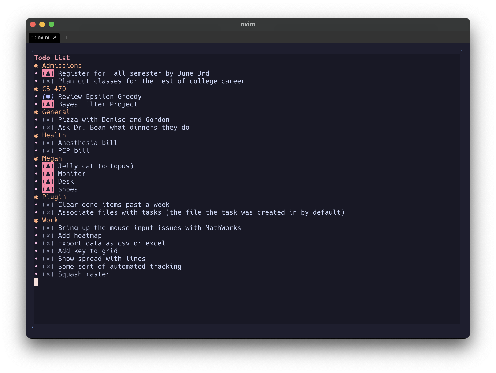
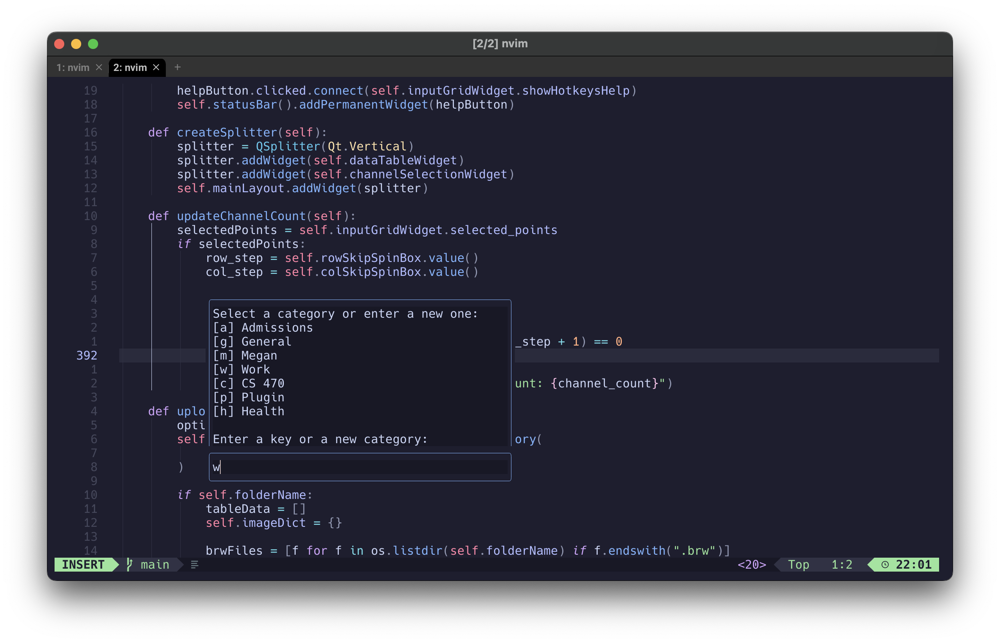

# It's a todo list... that's about it

<!--toc:start-->

- [It's a todo list... that's about it](#its-a-todo-list-thats-about-it)
  - [Installation](#installation)
  - [Usage](#usage)
  - [Todo (lol)](#todo-lol)
  <!--toc:end-->

## Installation

Just go ahead and use any plugin manager you like, for example with LazyVim:

```lua
return {
  {
    "booka66/nvim_todo",
  },
}
```

You're gonna need Neorg for this to work (or at least look good), so make sure you have that installed. The plugin will write a ~/.todo.json file to store your todo items. The popup is made by parsing this file, so if you delete it, you'll lose your todo list. The popup is rendered using Neorg's stuff, so that's why you'll need it to look good.

## Usage

Example usage:

Creating a new todo item:


- \<leader\>tn - New todo item
- \<leader\>to - Open todo list
  - esc or q: close the popup
  - enter: toggle item as done
  - i: toggle item as important
  - p: toggle item as pending
  - e: edit item (or category)
  - d: delete item (or category including all items)

## Todo (lol)

- Clear all done items after 5 (?) days of completion
- Associate items with the files they were created in (hit l to jump to the file)
